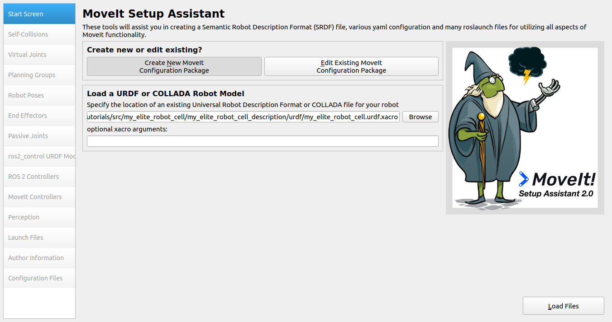
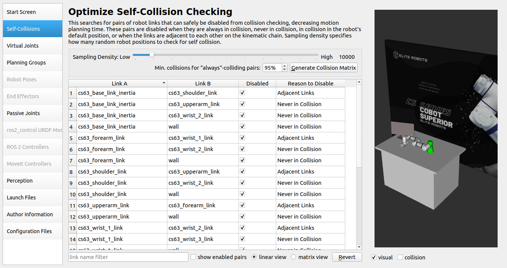
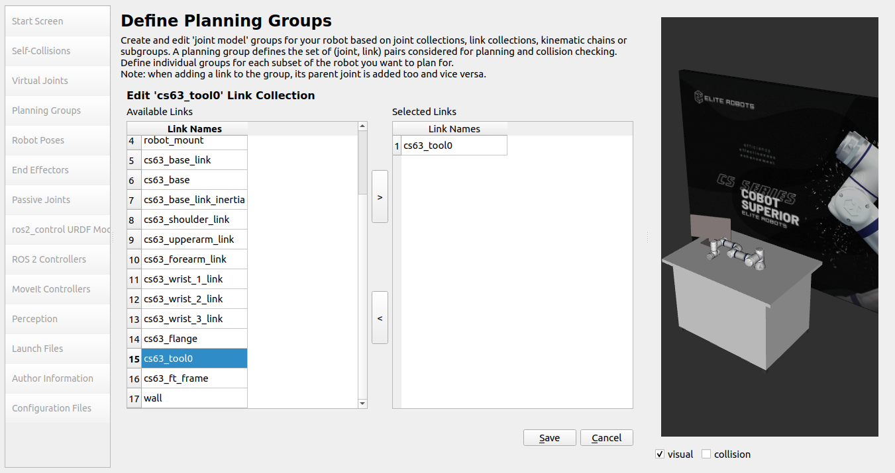
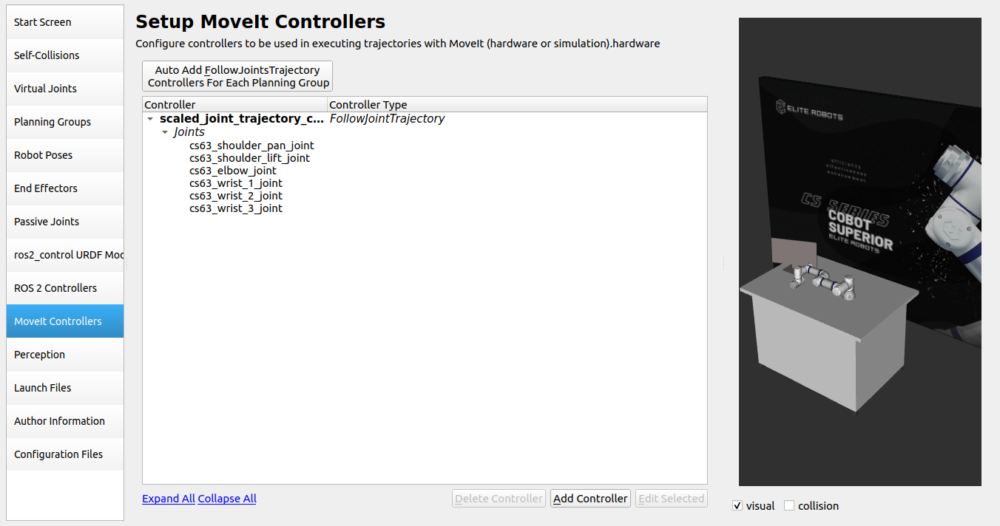
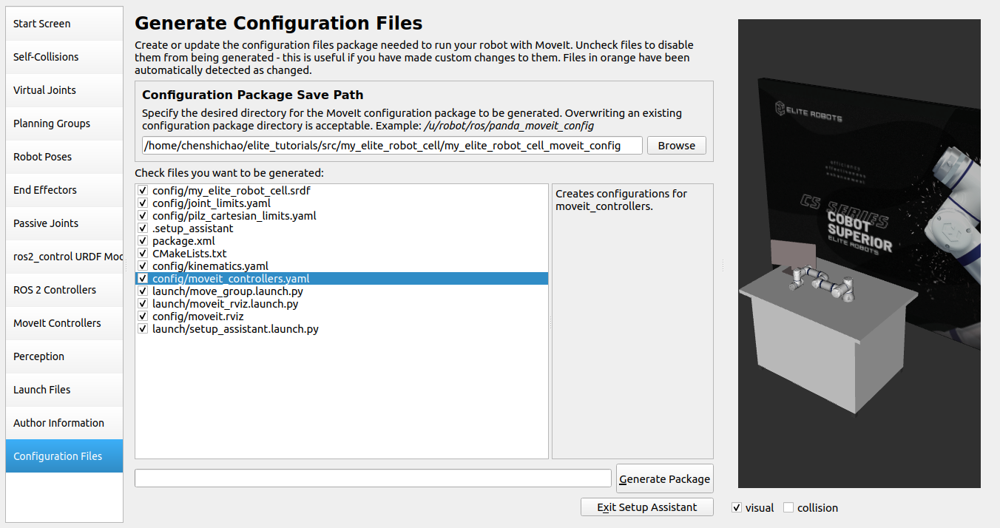
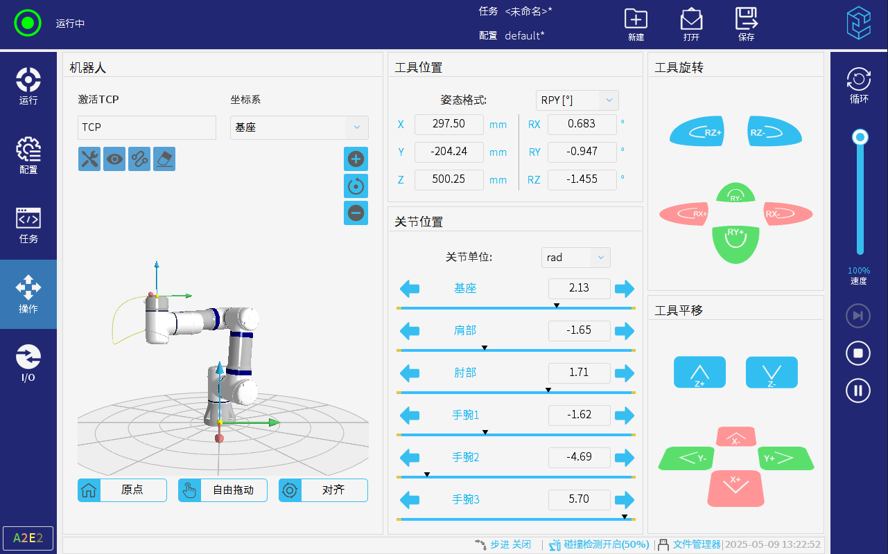

# ELITE Robots ROS2 tutorials

These tutorials should help users to get their custom use cases running. The following content is based on the UR Robot ROS2 tutorials and MoveIt2 tutorials. Thank you to the developers for their contributions to the open-source world.

## Example tutorials

### Custom work cell

Example about integrating an **Elite arm** into a custom workspace. We will build a custom work cell description, start the driver and create a **MoveIt2** config to enable trajectory planning with **MoveIt2**.

Please see the [package source code](https://github.com/Elite-Robots/Elite_Robots_CS_Ros2_Tutorials) for all files relevant for this example.

### Getting started:

#### 1. Assembling the URDF
The [eli_cs_robot_description](https://github.com/Elite-Robots/Elite_Robots_CS_ROS2_Driver/tree/main/eli_cs_robot_description) package provides macro files to generate an instance of a Elite Robots arm. This tutorial will use it to create a custom work cell with **Elite cs63**.

- ##### Work cell description
     ```xml
     <?xml version="1.0"?>
     <robot name="my_elite_robot_cell" xmlns:xacro="http://ros.org/wiki/xacro">
     
       <xacro:include filename="$(find my_elite_robot_cell_description)/urdf/my_elite_robot_cell_macro.xacro"/>
     
       <xacro:arg name="cs_type" default="cs63"/>
       <xacro:arg name="joint_limits_parameters_file" default="$(find eli_cs_robot_description)/config/$(arg cs_type)/joint_limits.yaml"/>
       <xacro:arg name="kinematics_parameters_file" default="$(find eli_cs_robot_description)/config/$(arg cs_type)/default_kinematics.yaml"/>
       <xacro:arg name="physical_parameters_file" default="$(find eli_cs_robot_description)/config/$(arg cs_type)/physical_parameters.yaml"/>
       <xacro:arg name="visual_parameters_file" default="$(find eli_cs_robot_description)/config/$(arg cs_type)/visual_parameters.yaml"/>
     
       <link name="world"/>
       <!--This will create the scene where the robot is located in-->
       <xacro:my_elite_robot_cell
         parent="world"
         cs_type="$(arg cs_type)"
         joint_limits_parameters_file="$(arg joint_limits_parameters_file)"
         kinematics_parameters_file="$(arg kinematics_parameters_file)"
         physical_parameters_file="$(arg physical_parameters_file)"
         visual_parameters_file="$(arg visual_parameters_file)"
         >
           <origin xyz="0 0 1" rpy="0 0 0" />
       </xacro:my_elite_robot_cell>
     
     </robot>
     ```

     Let’s break it down:

     First, we’ll have to **include** the macro to generate our custom work cell:
     
     ```xml
       <xacro:include filename="$(find my_elite_robot_cell_description)/urdf/my_elite_robot_cell_macro.xacro"/>
     ```

     This line only loads the macro for generating the robot work cell.

     We will need to provide some parameters to our work cell in order to parametrize the arm. Therefore, we need to declare certain arguments that must be passed to the macro.

     ```xml
       <xacro:arg name="cs_type" default="cs63"/>
       <xacro:arg name="joint_limits_parameters_file" default="$(find eli_cs_robot_description)/config/$(arg cs_type)/joint_limits.yaml"/>
       <xacro:arg name="kinematics_parameters_file" default="$(find eli_cs_robot_description)/config/$(arg cs_type)/default_kinematics.yaml"/>
       <xacro:arg name="physical_parameters_file" default="$(find eli_cs_robot_description)/config/$(arg cs_type)/physical_parameters.yaml"/>
       <xacro:arg name="visual_parameters_file" default="$(find eli_cs_robot_description)/config/$(arg cs_type)/visual_parameters.yaml"/>
     ```

     The workspace macro contains all items within the work cell including the robot arm. If you are not experienced in writing URDF, you may want to refer to this [tutorial](https://docs.ros.org/en/humble/Tutorials/Intermediate/URDF/URDF-Main.html). The macro’s content is generated using:

     ```xml
       <link name="world"/>
       <!--This will create the scene where the robot is located in-->
       <xacro:my_elite_robot_cell
         parent="world"
         cs_type="$(arg cs_type)"
         joint_limits_parameters_file="$(arg joint_limits_parameters_file)"
         kinematics_parameters_file="$(arg kinematics_parameters_file)"
         physical_parameters_file="$(arg physical_parameters_file)"
         visual_parameters_file="$(arg visual_parameters_file)"
         >
           <origin xyz="0 0 1" rpy="0 0 0" />
       </xacro:my_elite_robot_cell>
     ```

     Here, a **world** link is created, and the robot work cell is created relative to the **world** link.

- ##### Work cell macro
     The work cell macro is defined in the following manner:

     ```xml
     <?xml version="1.0"?>
     <robot xmlns:xacro="http://ros.org/wiki/xacro">
       <xacro:include filename="$(find eli_cs_robot_description)/urdf/cs_macro.xacro"/>
     
       <xacro:macro name="my_elite_robot_cell" params="
         parent
         *origin
         cs_type
         joint_limits_parameters_file
         kinematics_parameters_file
         physical_parameters_file
         visual_parameters_file
         ">
     
         <joint name="table_base_joint" type="fixed">
           <xacro:insert_block name="origin" />
           <parent link="${parent}" />
           <child link="table" />
         </joint>
     
         <link name="table">
           <visual>
             <geometry>
               <mesh filename="package://my_elite_robot_cell_description/meshes/table.dae"/>
             </geometry>
             <origin rpy="0 0 0" xyz="0.75 0.5 -1"/>
           </visual>
           <collision>
             <geometry>
               <mesh filename="package://my_elite_robot_cell_description/meshes/table.dae"/>
             </geometry>
             <origin rpy="0 0 0" xyz="0.75 0.5 -1"/>
           </collision>
         </link>
     
         <link name="monitor">
           <visual>
             <geometry>
               <mesh filename="package://my_elite_robot_cell_description/meshes/monitor.dae"/>
             </geometry>
           </visual>
           <collision>
             <geometry>
               <mesh filename="package://my_elite_robot_cell_description/meshes/monitor.dae"/>
             </geometry>
           </collision>
         </link>
         <joint name="base_to_monitor" type="fixed">
           <parent link="table"/>
           <child link="monitor"/>
           <origin xyz="0.2 0.6 0"/>
         </joint>
     
         <material name="white">
           <color rgba="1 1 1 1"/>
         </material>
     
         <link name="wall">
           <visual>
             <geometry>
               <mesh filename="package://my_elite_robot_cell_description/meshes/wall.dae"/>
             </geometry>
           </visual>
           <collision>
             <geometry>
               <box size="4.44 0.1 2.5"/>
             </geometry>
           </collision>
         </link>
         <joint name="base_to_wall" type="fixed">
           <parent link="table"/>
           <child link="wall"/>
           <origin xyz="1.25 1.5 0.5"/>
         </joint>
     
         <link name="robot_mount"/>
         <joint name="base_to_robot_mount" type="fixed">
           <parent link="table"/>
           <child link="robot_mount"/>
           <origin xyz="1.0 0.5 0" rpy="0 0 0" />
         </joint>
     
         <!--This will create the specific robot-->
         <xacro:cs_robot
           name="${cs_type}"
           tf_prefix="${cs_type}_"
           parent="robot_mount"
           joint_limits_parameters_file="${joint_limits_parameters_file}"
           kinematics_parameters_file="${kinematics_parameters_file}"
           physical_parameters_file="${physical_parameters_file}"
           visual_parameters_file="${visual_parameters_file}"
           generate_ros2_control_tag="false"
         >
           <origin xyz="0 0 0" rpy="0 0 0" />
         </xacro:cs_robot>
       </xacro:macro>
     
     </robot>
     ```

     This macro provides an example of what a custom work cell could resemble. Your workspace will likely vary from this one. Please feel free to modify this portion of the URDF to match your own setup. In this instance, our workspace comprises a table in front of a wall, featuring a monitor, and the **cs63** robot arm mounted on top.

     Please ensure that the custom work cell includes the parent link passed to the **cs_robot** macro. In this example, we have chosen to create a link named **robot_mount**.

     ```xml
         <link name="robot_mount"/>
         <joint name="base_to_robot_mount" type="fixed">
           <parent link="table"/>
           <child link="robot_mount"/>
           <origin xyz="1.0 0.5 0" rpy="0 0 0" />
         </joint>
     ```

     After that, we will be able to create the actual **robot arm** by calling this macro.

     ```xml
         <xacro:cs_robot
           name="${cs_type}"
           tf_prefix="${cs_type}_"
           parent="robot_mount"
           joint_limits_parameters_file="${joint_limits_parameters_file}"
           kinematics_parameters_file="${kinematics_parameters_file}"
           physical_parameters_file="${physical_parameters_file}"
           visual_parameters_file="${visual_parameters_file}"
         >
           <origin xyz="0 0 0" rpy="0 0 0" />
         </xacro:ur_robot>
     ```

     Please note that the **origin** parameter is passed in a different manner than the other parameters.

     Before testing the code, it’s essential to build and source the **Colcon** workspace.

     ```bash
     #cd to your colcon workspace root
     cd ~/colcon_ws
     
     #source and build your workspace
     colcon build
     source install/setup.bash
     ```
     
     We can view our custom workspace by running the following command:

     ```bash
     #launch rviz
     ros2 launch my_elite_robot_cell_description view_robot.launch.py
     ```

     Use the sliders in **joint_state_publisher_gui** to move the virtual robot. The expected effect should be as follows:
     
     


#### 2. Start the eli_cs_robot_driver 
In the previous chapter, we created a custom scene description that includes the robot. To make this description usable in **ros2_control** (so that it can be called by **eli_cs_robot_driver**), we need to add control information. Additionally, we will create a custom launch file to start our demonstration program.

For this purpose, we will generate a new package called **my_elite_robot_cell_control**.

- ##### Create a description using the ros2_control tag
     The first step is to create a description file that contains control instructions:

     ```xml
     <?xml version="1.0"?>
     <robot name="my_elite_robot_cell" xmlns:xacro="http://ros.org/wiki/xacro">
     
       <!--First, include the macro from our custom description-->
       <xacro:include filename="$(find my_elite_robot_cell_description)/urdf/my_elite_robot_cell_macro.xacro"/>
       <!--The eli_cs_robot_description package already provides a control tag for the ELITE arm, we can directly include-->
       <xacro:include filename="$(find eli_cs_robot_description)/urdf/cs.ros2_control.xacro"/>
     
       <!--We need to specify the arguments used for parametrizing our description-->
       <!--Create a folder for wanted cs_type and copy those files from eli_cs_robot_description package in there; copied only cs63 files -->
       <!--You could as well point to eli_cs_robot_description but this way you make sure you use the same files as start_robot.launch.py which searches in runtime_config_package for joint_limits.yaml, physical_parameters.yaml, visual_parameters.yaml and in description_package for default_kinematics.yaml (last one can be overwritten)-->
       <xacro:arg name="cs_type" default="cs63"/>
       <xacro:arg name="joint_limit_params" default="$(find my_elite_robot_cell_control)/config/$(arg cs_type)/joint_limits.yaml"/>
       <xacro:arg name="kinematics_params" default="$(find my_elite_robot_cell_control)/config/$(arg cs_type)/default_kinematics.yaml"/>
       <xacro:arg name="physical_params" default="$(find my_elite_robot_cell_control)/config/$(arg cs_type)/physical_parameters.yaml"/>
       <xacro:arg name="visual_params" default="$(find my_elite_robot_cell_control)/config/$(arg cs_type)/visual_parameters.yaml"/>
     
       <xacro:arg name="robot_ip" default="0.0.0.0"/>
       <xacro:arg name="local_ip" default="0.0.0.0"/>
       <xacro:arg name="headless_mode" default="false" />
       <xacro:arg name="cs_script_filename" default="$(find eli_cs_robot_driver)/resources/external_control.script"/>
       <xacro:arg name="cs_output_recipe_filename" default="$(find eli_cs_robot_driver)/resources/output_recipe.txt"/>
       <xacro:arg name="cs_input_recipe_filename" default="$(find eli_cs_robot_driver)/resources/input_recipe.txt"/>
       <xacro:arg name="use_fake_hardware" default="false" />
       <xacro:arg name="fake_sensor_commands" default="false" />
       <!--find hash_kinematics in kinematics_params-->
       <xacro:property name="kinematics_params_file" value="$(arg kinematics_params)"/>
     
     
       <link name="world" />
     
       <!--Create the scene description including the robot-->
       <xacro:my_elite_robot_cell
         parent="world"
         cs_type="$(arg cs_type)"
         joint_limits_parameters_file="$(arg joint_limit_params)"
         kinematics_parameters_file="$(arg kinematics_params)"
         physical_parameters_file="$(arg physical_params)"
         visual_parameters_file="$(arg visual_params)"
       >
         <origin xyz="0 0 1" rpy="0 0 0" />
       </xacro:my_elite_robot_cell>
     
     
       <!--Create the control tag for the ELITE robot-->
       <xacro:cs_ros2_control
         name="$(arg cs_type)"
         tf_prefix="$(arg cs_type)_"
         robot_ip="$(arg robot_ip)"
         local_ip="$(arg local_ip)"
         script_filename="$(arg cs_script_filename)"
         output_recipe_filename="$(arg cs_output_recipe_filename)"
         input_recipe_filename="$(arg cs_input_recipe_filename)"
         use_fake_hardware="$(arg use_fake_hardware)"
         fake_sensor_commands="$(arg fake_sensor_commands)"
         headless_mode="$(arg headless_mode)"
       />
     
       <!--If you had more controlled devices in your description, e.g. a gripper, you can add another ros2_control tag here-->
     
     </robot>
     ```

     This URDF is very similar to the one we previously assembled. We simply need to include the **ros2_control** macro.

     ```xml
       <xacro:include filename="$(find eli_cs_robot_description)/urdf/cs.ros2_control.xacro"/>
     ```

     Define the necessary parameters to be passed to the macro:

     ```xml
       <xacro:arg name="robot_ip" default="0.0.0.0"/>
       <xacro:arg name="local_ip" default="0.0.0.0"/>
       <xacro:arg name="headless_mode" default="false" />
       <xacro:arg name="cs_script_filename" default="$(find eli_cs_robot_driver)/resources/external_control.script"/>
       <xacro:arg name="cs_output_recipe_filename" default="$(find eli_cs_robot_driver)/resources/output_recipe.txt"/>
       <xacro:arg name="cs_input_recipe_filename" default="$(find eli_cs_robot_driver)/resources/input_recipe.txt"/>
       <xacro:arg name="use_fake_hardware" default="false" />
       <xacro:arg name="fake_sensor_commands" default="false" />
     ```

     Then, invoke the macro **cs_ros2_control** by providing all the specified parameters.

     ```xml
       <xacro:cs_ros2_control
         name="$(arg cs_type)"
         tf_prefix="$(arg cs_type)_"
         robot_ip="$(arg robot_ip)"
         local_ip="$(arg local_ip)"
         script_filename="$(arg cs_script_filename)"
         output_recipe_filename="$(arg cs_output_recipe_filename)"
         input_recipe_filename="$(arg cs_input_recipe_filename)"
         use_fake_hardware="$(arg use_fake_hardware)"
         fake_sensor_commands="$(arg fake_sensor_commands)"
         headless_mode="$(arg headless_mode)"
       />
     ```

- ##### Extract the calibration data
     A very important step is to extract the specific calibration data of the robot and save it to our work cell startup package. The actual calibration data can be obtained from the [eli_cs_robot_calibration](https://github.com/Elite-Robots/Elite_Robots_CS_ROS2_Driver/tree/main/eli_cs_robot_description) node. For now, we are just copying the default calibration data of **CS63**.

     ```bash
     cp $(ros2 pkg prefix eli_cs_robot_description)/share/eli_cs_robot_description/config/cs63/default_kinematics.yaml my_elite_robot_cell_control/config/my_elite_robot_calibration.yaml
     ```

- ##### Create start_robot launch file
     The **start_robot** launch file includes the **elite_control.launch.py** launch file with the correct description file and prefix settings.
   
     ```python
     from launch_ros.substitutions import FindPackageShare
     from launch import LaunchDescription
     from launch.actions import DeclareLaunchArgument, IncludeLaunchDescription
     from launch.launch_description_sources import PythonLaunchDescriptionSource
     from launch.substitutions import (
         LaunchConfiguration,
         PathJoinSubstitution,
     )
     
     
     def generate_launch_description():
         # declare arguments
         declared_arguments = []
         declared_arguments.append(
             DeclareLaunchArgument(
                 "cs_type",
                 description="Type/series of used ELITE robot.",
                 choices=[
                     "cs63",
                     "cs66",
                     "cs612",
                     "cs616",
                     "cs620",
                     "cs625",
                 ],
                 default_value="cs63",
             )
         )
         declared_arguments.append(
             DeclareLaunchArgument(
                 "robot_ip",
                 default_value="192.168.51.146",  # put your robot's IP address here
                 description="IP address by which the robot can be reached.",
             )
         )
         declared_arguments.append(
             DeclareLaunchArgument(
                 "local_ip",
                 default_value="192.168.51.9",  # put your current local IP address here
                 description="Current local IP address.",
             )
         )
         declared_arguments.append(
             DeclareLaunchArgument("launch_rviz", default_value="true", description="Launch RViz?")
         )
         declared_arguments.append(
             DeclareLaunchArgument(
                 "use_fake_hardware",
                 default_value="false",
                 description="Start robot with fake hardware mirroring command to its states.",
             )
         )
         declared_arguments.append(
             DeclareLaunchArgument(
                 "fake_sensor_commands",
                 default_value="false",
                 description="Enable fake command interfaces for sensors used for simple simulations. "
                 "Used only if 'use_fake_hardware' parameter is true.",
             )
         )
         declared_arguments.append(
             DeclareLaunchArgument(
                 "description_package",
                 default_value="my_elite_robot_cell_control",
                 description="description package",
             )
         )
         declared_arguments.append(
             DeclareLaunchArgument(
                 "description_file",
                 default_value="my_elite_robot_cell_controlled.urdf.xacro",
                 description="URDF/XACRO description file with the robot.",
             )
         )
         declared_arguments.append(
             DeclareLaunchArgument(
                 "kinematics_params_file",
                 default_value=PathJoinSubstitution(
                     [
                         FindPackageShare("my_elite_robot_cell_control"),
                         "config",
                         "my_elite_robot_calibration.yaml",
                     ]
                 ),
                 description="The calibration configuration of the actual robot used.",
             )
         )
         declared_arguments.append(
             DeclareLaunchArgument(
                 "initial_joint_controller",
                 default_value="scaled_joint_trajectory_controller",
                 description="Initially loaded robot controller.",
                 choices=[
                     "scaled_joint_trajectory_controller",
                     "joint_trajectory_controller",
                     "forward_velocity_controller",
                     "forward_position_controller",
                 ],
             )
         )
         declared_arguments.append(
             DeclareLaunchArgument(
                 "activate_joint_controller",
                 default_value="true",
                 description="Activate loaded joint controller.",
             )
         )
         declared_arguments.append(
             DeclareLaunchArgument(
                 "headless_mode",
                 default_value="false",
                 description="Enable headless mode for robot control",
             )
         )
     
         # initialize arguments
         cs_type = LaunchConfiguration("cs_type")
         robot_ip = LaunchConfiguration("robot_ip")
         local_ip = LaunchConfiguration("local_ip")
         launch_rviz = LaunchConfiguration("launch_rviz")
         use_fake_hardware = LaunchConfiguration("use_fake_hardware")
         fake_sensor_commands = LaunchConfiguration("fake_sensor_commands")
         controllers_file = LaunchConfiguration("controllers_file")
         description_package = LaunchConfiguration("description_package")
         description_file = LaunchConfiguration("description_file")
         kinematics_params_file = LaunchConfiguration("kinematics_params_file")
         initial_joint_controller = LaunchConfiguration("initial_joint_controller")
         activate_joint_controller = LaunchConfiguration("activate_joint_controller")
         headless_mode = LaunchConfiguration("headless_mode")
     
         base_launch = IncludeLaunchDescription(
             PythonLaunchDescriptionSource(
                 [
                     PathJoinSubstitution([FindPackageShare("eli_cs_robot_driver"), "launch"]),
                     "/elite_control.launch.py",
                 ]
             ),
             launch_arguments={
                 "cs_type": cs_type,
                 "robot_ip": robot_ip,
                 "local_ip": local_ip,
                 "tf_prefix": [LaunchConfiguration("cs_type"), "_"],
                 "launch_rviz": launch_rviz,
                 "use_fake_hardware": use_fake_hardware,
                 "fake_sensor_commands": fake_sensor_commands,
                 "description_package": description_package,
                 "description_file": description_file,
                 "kinematics_params_file": kinematics_params_file,
                 "initial_joint_controller": initial_joint_controller,
                 "activate_joint_controller": activate_joint_controller,
                 "headless_mode": headless_mode,
             }.items(),
         )
     
         return LaunchDescription(declared_arguments + [base_launch])
     ```

     With these in place, we can use the following command to start the robot:

     ```bash
     ros2 launch my_elite_robot_cell_control start_robot.launch.py headless_mode:=true
     ```

     Note that when using it, remember to change the corresponding **robot IP** and **local IP**, and replace the **robot type** according to the actual model. The **headless_mode** option can be set to `true` to reduce reliance on the teach pendant. When multiple nodes might open RViz, **launch_rviz** can be set to `false` to minimize terminal performance consumption.

- ##### Test all functions
     Before testing the code, you must build and source the **Colcon** workspace:

     ```bash
     #cd to your colcon workspace root, e.g.
     cd ~/colcon_ws
     
     #source and build your workspace
     colcon build
     source install/setup.bash
     ```

     With these in place, we can use the following command to start the real robot. Since the **Elite_Robots_CS_ROS2_Driver** package may have been locally compiled, remember to load this driver package into the current workspace before starting the node:

     ```bash
     #start the driver with real hardware
     ros2 launch my_elite_robot_cell_control start_robot.launch.py
     ```

#### 3. Build the MoveIt! config
At this point, you should be able to run **eli_cs_robot_driver** in your custom **Elite** setup. Now, only one last step remains before actually planning and executing the trajectory.

To use MoveIt! 2 to complete this task (which will handle trajectory planning for us), we need to set up a MoveIt! configuration package. To create such a MoveIt! configuration package, MoveIt! provides a very useful **Setup Assistant**.

- ##### Setup Assistant
     We can start the MoveIt! Setup Assistant by running the following command:

     ```bash
     ros2 launch moveit_setup_assistant setup_assistant.launch.py
     ```

     Please note that MoveIt! itself provides a detailed tutorial on how to use the **Setup Assistant**, so you may want to read that first. Although the **Setup Assistant** is very intuitive, the following sections will discuss some practical tips and suggestions.

     The first task required by the **MoveIt! Setup Assistant** is to load the URDF, with the optional addition of xacro parameters. For example, if you want to modify **cs_type**, you can specify it here. In this demonstration, we will use the default description values.

     

     Next, make sure that the generated self-collisions are correctly detected. In our example, the robot is placed on the table, and when all joints are in the 0 position, you can observe whether a collision occurs.

     

     Skip adding virtual joints for now and proceed with setting up the planning groups. You can add a planning group called **elite_arm** (**planning group(s)**). A reasonable and stable approach is to define it as a kinematic chain as follows:

     

     

     

     

     Your planning group (**planning group(s)**) should look something like this:

     We will skip the **ros2_control** related setup points since we have already configured them in the control package.
     
     In the **MoveIt Controllers** step, we will set the required controller to **“scaled_joint_trajectory_controller”**.
     
     
     
     We skip the **Perception** section since no cameras are set up in the current scenario.
     
     In the next step, we modify the **Launch Files** generated by the assistant. We only generate **“RViz Launch and Config”**, **“MoveGroup Launch”**, and **“Setup Assistant Launch”**. The other launch files are used for starting a demonstration with mock hardware, which essentially duplicates what we have already completed in the control package. Since we are not using the **Warehouse** feature at the moment, we also skip that file.
     
     
     
     After filling in the author information, we select the configuration files to generate. Similarly, we streamline all files used for mock hardware startup.
     
     
     
     After entering all the information, you can generate the package and close the Setup Assistant.
     
- ##### Manual adjustments
     Before actually using our package, we need to adjust the joint limits. Since MoveIt! requires joint acceleration limits to be specified, but these are not included in the description file, we need to define them in the generated **config/joint_limits.yaml** file.

     These limits are not part of the robot arm description because the arm itself does not have physical acceleration constraints. Acceleration is highly dependent on the robot’s current posture and the force exerted by the TCP (e.g. force induced by the payload at the TCP). Setting the acceleration limits to 4.0 for all joints is a conservative choice. Higher values may lead to unexpected slowdowns during execution or even protective stops, while lower values will result in slower movements due to longer acceleration and deceleration phases in the trajectory.

     ```yaml
     # joint_limits.yaml allows the dynamics properties specified in the URDF to be overwritten or augmented as needed
     
     # For beginners, we downscale velocity and acceleration limits.
     # You can always specify higher scaling factors (<= 1.0) in your motion requests.  
     # Increase the values below to 1.0 to always move at maximum speed.
     default_velocity_scaling_factor: 0.1
     default_acceleration_scaling_factor: 0.1
     
     # Specific joint properties can be changed with the keys [max_position, min_position, max_velocity, max_acceleration]
     # Joint limits can be turned off with [has_velocity_limits, has_acceleration_limits]
     joint_limits:
       cs63_elbow_joint:
         has_velocity_limits: true
         max_velocity: 3.1415926535897931
         has_acceleration_limits: true
         max_acceleration: 4.0
       cs63_shoulder_lift_joint:
         has_velocity_limits: true
         max_velocity: 3.1415926535897931
         has_acceleration_limits: true
         max_acceleration: 4.0
       cs63_shoulder_pan_joint:
         has_velocity_limits: true
         max_velocity: 3.1415926535897931
         has_acceleration_limits: true
         max_acceleration: 4.0
       cs63_wrist_1_joint:
         has_velocity_limits: true
         max_velocity: 6.2831853071795862
         has_acceleration_limits: true
         max_acceleration: 4.0
       cs63_wrist_2_joint:
         has_velocity_limits: true
         max_velocity: 6.2831853071795862
         has_acceleration_limits: true
         max_acceleration: 4.0
       cs63_wrist_3_joint:
         has_velocity_limits: true
         max_velocity: 6.2831853071795862
         has_acceleration_limits: true
         max_acceleration: 4.0
     ```

     Please note that you can also change the default velocity and acceleration scaling factors in this file. Additionally, if you wish to specify position or velocity limits different from those in the description file, you can set them here. Keep in mind that these limits are only used for trajectory planning and do not necessarily apply to actual execution. If you send trajectories from a source other than MoveIt!, these limits will not take effect!

- ##### Usage
     Before testing the code, we must build and configure our **Colcon** workspace:
     
     ```bash
     #cd to your colcon workspace root
     cd ~/colcon_ws
     
     #source and build your workspace
     colcon build
     source install/setup.bash
     ```

     Now, we are ready to use MoveIt! on the actual **cs63** robot. MoveIt! also provides an option to start the robot using simulated hardware.

     To start the complete system, three **launch** files need to be started in three separate terminals. Since the **Elite_Robots_CS_ROS2_Driver** package may have been locally compiled, make sure to load this driver package into the current workspace before launching the node.

     First, we need to start a robot, which can be either simulated or real. If you are starting a **real robot**, please ensure that the **external_control** program is active on the robot and that the robot itself is in an **active state**.

     ```bash
     # You can switch to fake hardware if you prefer
     ros2 launch my_elite_robot_cell_control start_robot.launch.py headless_mode:=true launch_rviz:=false
     ```

     Second, we can start the **move_group** node by running the **launch** file the setup assistant created for us:

     ```bash
     ros2 launch my_elite_robot_cell_moveit_config move_group.launch.py
     ```

     If everything went well you should see the output:  **"You can start planning now!"**.

     To interact with the MoveIt! setup, you can start RViz using the correct setup file:

     ```bash
     ros2 launch my_elite_robot_cell_moveit_config moveit_rviz.launch.py
     ```

     From this setup, you can start developing applications involving a custom **move_group** interface or similar functionality.

#### 4. Implement a simple MoveIt2 C++ project
For tutorials on **MoveIt2** features, you can refer to [MoveIt2 Tutorials](https://moveit.picknik.ai/humble/doc/tutorials/getting_started/getting_started.html). Currently, Elite ROS2's functionality is based on the **humble** branch, so remember to switch to the **humble** branch when following the MoveIt2 tutorial. Here, we will implement a simple **MoveIt2 C++** project.

- ##### Create a package
     Open the terminal and load the ROS2 installation to ensure that the `ros2` commands can run properly.
     Navigate to the created **$COLCON_WS** directory, which is mentioned in the **README.md** file.
     Enter the **src** directory, where the source code will be placed.
     Use the **ros2** command-line tool to create a new package:
     
     ```bash
     ros2 pkg create --build-type ament_cmake --dependencies moveit_ros_planning_interface rclcpp --node-name hello_moveit hello_moveit
     ```
     This operation will create several files in the new directory.
     Please note that **moveit_ros_planning_interface** and **rclcpp** have been added as dependencies.
     Open the newly created source file **$COLCON_WS/src/hello_moveit/src/hello_moveit.cpp** in an editor.

- ##### Create a ROS Node and Executor
     The first block of code is boilerplate code, similar to structures seen in the ROS 2 tutorials.
     
     ```c++
     #include <memory>
     
     #include <rclcpp/rclcpp.hpp>
     #include <moveit/move_group_interface/move_group_interface.h>
     
     int main(int argc, char * argv[])
     {
       // Initialize ROS and create the Node
       rclcpp::init(argc, argv);
       auto const node = std::make_shared<rclcpp::Node>(
         "hello_moveit",
         rclcpp::NodeOptions().automatically_declare_parameters_from_overrides(true)
       );
     
       // Create a ROS logger
       auto const logger = rclcpp::get_logger("hello_moveit");
     
       // Next step goes here
     
       // Shutdown ROS
       rclcpp::shutdown();
       return 0;
     }
     ```
     
- ##### Analyze the code
     At the top, the included headers consist mainly of standard C++ headers, along with ROS and MoveIt-related headers that will be used later. 
     
     After that, there is a common **rclcpp** initialization call, followed by the creation of a ROS node.
     
     ```c++
     auto const node = std::make_shared<rclcpp::Node>(
       "hello_moveit",
       rclcpp::NodeOptions().automatically_declare_parameters_from_overrides(true)
     );
     ```
     
     The first parameter is a string that ROS will use to create a unique node. The second parameter is required by MoveIt because it relates to how ROS parameters are used.

     Finally, the code shuts down ROS.
     
- ##### Plan and execute using **MoveGroupInterface**
     In the comment labeled **"Next step goes here"**, add the following code:
     
     ```c++
       // Create the MoveIt MoveGroup Interface
       using moveit::planning_interface::MoveGroupInterface;
       auto move_group_interface = MoveGroupInterface(node, "elite_arm");
       
       // Set a target Pose
       auto const target_pose = []{
         geometry_msgs::msg::Pose msg;
         msg.orientation.w = 0.0;
         msg.position.x = 1.3;
         msg.position.y = 0.3;
         msg.position.z = 1.5;
         return msg;
       }();
       move_group_interface.setPoseTarget(target_pose);
       
       // Create a plan to that target pose
       auto const [success, plan] = [&move_group_interface]{
         moveit::planning_interface::MoveGroupInterface::Plan msg;
         auto const ok = static_cast<bool>(move_group_interface.plan(msg));
         return std::make_pair(ok, msg);
       }();
     
       // Execute the plan
       if(success) {
         move_group_interface.execute(plan);
       } else {
         RCLCPP_ERROR(logger, "Planing failed!");
       }
       
       // Set a target Joints
       std::vector<double> joint_values = {0.0, -0.5, 0.3, -1.2, 0.8, 0.5};
       move_group_interface.setJointValueTarget(joint_values);
       
       // Create a plan to that target joints
       auto const [success1, plan1] = [&move_group_interface]{
         moveit::planning_interface::MoveGroupInterface::Plan msg;
         auto const ok = static_cast<bool>(move_group_interface.plan(msg));
         return std::make_pair(ok, msg);
       }();
       
       // Execute the plan
       if(success1) {
         move_group_interface.execute(plan1);
       } else {
         RCLCPP_ERROR(logger, "Planing failed!");
       }
     ```
     
- ##### Build and Run
     Before testing the code, we must build and configure our **Colcon** workspace.   Since the **Elite_Robots_CS_ROS2_Driver** package may have been locally compiled, remember to load this driver package into the current workspace before launching the node:
     
     ```bash
     #cd to your colcon workspace root
     cd ~/colcon_ws
     
     #source and build your workspace
     colcon build
     source install/setup.bash
     ```
     Open a new terminal and run the program.
     
     ```bash
     ros2 run hello_moveit hello_moveit
     ```
     
     By running the three node programs from **Step 3**, you will be able to observe the robot's movements.
     
     
     
     